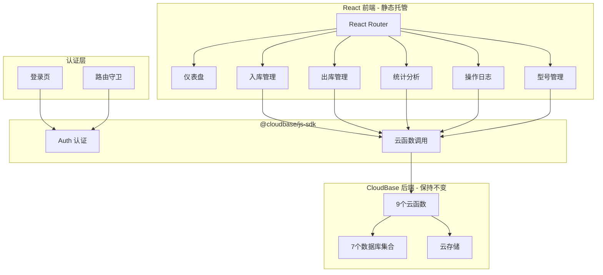

## 产品概述

将现有的「出入库记录查询系统」从原生 HTML/JS 重构为 React 企业管理后台，集成 CloudBase 用户认证系统，保留全部现有云函数和数据库集合，最终部署在 CloudBase 静态托管上。

## 核心功能

- **用户认证**：集成 CloudBase Auth，支持邮箱/密码登录，替换现有匿名登录，新增登录页和用户信息管理
- **入库记录管理**：分页列表、多维筛选（客户名/渠道类型/渠道名/日期/快递单号/手机型号/异常状态）、详情查看、编辑、删除
- **出库记录管理**：分页列表、筛选（客户名/日期/手机型号）、详情查看、编辑、删除
- **统计分析**：按日期和手机型号统计出入库数量与订单数，recharts 图表可视化
- **操作日志**：分页列表、筛选（操作人/操作类型/日志类型/日期）、记录修改历史查看
- **手机型号管理**：品牌/型号增删改查
- **云存储图片**：照片查看、获取真实图片URL
- **企业微信通知**：记录变更时推送通知

## 技术栈

- **前端框架**：React 18 + TypeScript + Vite 5
- **UI 组件库**：TDesign React
- **样式方案**：Tailwind CSS 3.4.17 + tailwind-merge + tailwindcss-animate
- **图表库**：recharts
- **图标库**：lucide-react + react-icons
- **路由**：react-router-dom v6
- **CloudBase SDK**：@cloudbase/js-sdk（Web 端 SDK）
- **后端运行时**：现有 CloudBase 云函数（9个，保持不变）
- **数据库**：现有 CloudBase 文档数据库（7个集合，保持不变）
- **存储**：现有 CloudBase 云存储（保持不变）
- **认证**：CloudBase Auth（邮箱/密码登录，替换匿名登录）
- **部署**：CloudBase 静态托管

## 实现方案

将原生 HTML/JS 项目完整重构为 React + TypeScript 项目。保留全部现有 9 个云函数和 7 个数据库集合不变，前端通过 @cloudbase/js-sdk 调用云函数和直连数据库。新增 CloudBase 邮箱/密码认证，替换匿名登录，新增登录页面和路由守卫。

### 关键技术决策

1. **CloudBase Auth 邮箱/密码登录**：替换匿名登录，实现真正的用户身份管理，操作日志可关联真实用户
2. **react-router-dom v6 路由**：实现 SPA 页面切换，登录页独立路由，其余页面需登录后访问
3. **自定义 Hooks 封装数据层**：将现有 API 模块重构为 React Hooks（useInbound、useOutbound、useLogs 等），统一管理分页、筛选、加载状态
4. **保留全部云函数不变**：现有 9 个云函数逻辑完整，前端重构无需修改后端
5. **TDesign 组件库**：企业级组件库，Table/Form/Dialog 等组件直接替代现有手写 DOM 渲染

### 实施注意事项

- 数据库安全规则需更新：从匿名可读改为登录用户可读，仅创建者可写
- 登录页不需要认证守卫，其余页面均需检查登录状态
- 云函数调用需在登录后进行，否则会因权限问题失败
- user_whitelist 集合可用于实现白名单权限控制
- 现有 phonePhotos 使用 cloud:// 协议，需通过 getRealImageUrl 云函数获取 HTTP URL
- 代码中不使用 try-catch，使用 console.error 输出错误

## 架构设计



## 目录结构

```
/Users/zhibinxiao/CodeBuddy/hc-admin/
├── cloudbaserc.json              # [NEW] CloudBase 项目配置
├── package.json                   # [NEW] 根目录依赖和脚本
├── .env                           # [NEW] 环境变量（VITE_CLOUDBASE_ENV）
├── .gitignore                     # [NEW] Git 忽略配置
├── index.html                     # [NEW] Vite HTML 入口
├── src/
│   ├── main.tsx                   # [NEW] 应用入口
│   ├── App.tsx                    # [NEW] 根组件（路由配置）
│   ├── vite-env.d.ts              # [NEW] Vite 类型声明
│   ├── lib/
│   │   └── cloudbase.ts           # [NEW] CloudBase SDK 初始化、认证、云函数调用封装
│   ├── types/
│   │   └── index.ts               # [NEW] 全局类型定义（Record, PhoneModel, OperationLog 等）
│   ├── hooks/
│   │   ├── useAuth.ts             # [NEW] 认证 Hook（登录/登出/注册/当前用户）
│   │   ├── useInbound.ts          # [NEW] 入库记录 Hook（分页/筛选/CRUD）
│   │   ├── useOutbound.ts         # [NEW] 出库记录 Hook（分页/筛选/CRUD）
│   │   ├── useStats.ts            # [NEW] 统计数据 Hook
│   │   ├── useLogs.ts             # [NEW] 操作日志 Hook（分页/筛选）
│   │   ├── usePhoneModels.ts      # [NEW] 手机型号管理 Hook
│   │   └── useStorage.ts         # [NEW] 云存储 Hook（图片URL获取）
│   ├── pages/
│   │   ├── Login.tsx              # [NEW] 登录页（邮箱/密码表单）
│   │   ├── Dashboard.tsx          # [NEW] 仪表盘首页（数据概览+快捷入口）
│   │   ├── InboundList.tsx        # [NEW] 入库记录列表页（筛选+表格+分页+详情/编辑弹窗）
│   │   ├── OutboundList.tsx       # [NEW] 出库记录列表页（筛选+表格+分页+详情/编辑弹窗）
│   │   ├── Stats.tsx              # [NEW] 统计分析页（日期选择+型号统计表格+图表）
│   │   ├── Logs.tsx               # [NEW] 操作日志页（筛选+列表+分页+修改历史弹窗）
│   │   └── PhoneModels.tsx        # [NEW] 手机型号管理页（品牌/型号增删改查）
│   ├── components/
│   │   ├── Layout.tsx             # [NEW] 应用布局（深色侧边栏+顶栏+用户信息+登出）
│   │   ├── AuthGuard.tsx          # [NEW] 路由守卫组件（未登录重定向到登录页）
│   │   ├── RecordDetail.tsx       # [NEW] 记录详情弹窗（入库/出库复用）
│   │   ├── RecordEdit.tsx         # [NEW] 记录编辑弹窗（表单+型号选择+保存）
│   │   ├── FilterBar.tsx          # [NEW] 通用筛选栏组件
│   │   └── PhotoGallery.tsx       # [NEW] 照片画廊组件（缩略图+点击放大）
│   ├── utils/
│   │   ├── format.ts              # [NEW] 格式化工具（日期、渠道类型映射）
│   │   └── constants.ts           # [NEW] 常量定义（渠道类型映射、企业微信配置等）
│   └── styles/
│       └── index.css              # [NEW] Tailwind 入口 + 全局样式
├── functions/                      # [KEEP] 云函数目录（保持不变）
├── tsconfig.json                  # [NEW] TypeScript 配置
├── tsconfig.app.json              # [NEW] 应用 TS 配置
├── tsconfig.node.json             # [NEW] Node TS 配置
├── vite.config.ts                 # [NEW] Vite 构建配置
├── tailwind.config.js             # [NEW] Tailwind 配置
└── postcss.config.js              # [NEW] PostCSS 配置
```

## 设计风格

采用 Glassmorphism + 现代企业管理后台风格。深色渐变侧边栏搭配浅色内容区，卡片式布局配合微动画和渐变强调色。

## 页面规划

### 页面1：登录页

- 居中登录卡片，毛玻璃效果背景
- 应用 Logo + 名称
- 邮箱/密码输入框 + 登录按钮
- 注册链接

### 页面2：仪表盘

- 顶部导航栏：Logo + 应用名称 + 用户头像 + 登出
- 侧边栏：深色渐变背景，图标+文字导航项，当前项高亮发光
- 数据概览：4张统计卡片（入库记录数、出库记录数、入库手机数、出库手机数）
- 最近操作：时间线列表展示最近变更记录
- 快捷操作：按钮组跳转常用功能

### 页面3：入库记录

- 筛选栏：客户名/渠道类型/渠道名/日期范围/快递单号/手机型号/异常状态
- 数据表格：TDesign Table，斑马纹+悬浮高亮，支持排序分页
- 操作列：查看详情/编辑/删除
- 详情弹窗：记录完整信息+照片画廊+修改历史
- 编辑弹窗：TDesign Form 表单+手机型号动态添加

### 页面4：出库记录

- 筛选栏：客户名/日期范围/手机型号
- 数据表格+操作列+详情/编辑弹窗（复用入库组件）

### 页面5：统计分析

- 日期选择器
- recharts 折线图：出入库趋势
- TDesign Table：按型号统计表格（入库数/出库数/变动）
- 订单数汇总表格

### 页面6：操作日志

- 筛选栏：操作人/操作类型/日志类型/日期范围
- 日志列表：操作时间+操作人+操作类型标签+操作内容
- 修改历史弹窗：变更前后对比

### 页面7：手机型号管理

- 品牌手风琴列表：点击展开/收起型号
- 添加品牌/添加型号表单

## Agent Extensions

### SubAgent

- **code-explorer**: 在重构过程中搜索现有代码模式、确认云函数接口和数据结构，确保 React 重构准确还原业务逻辑