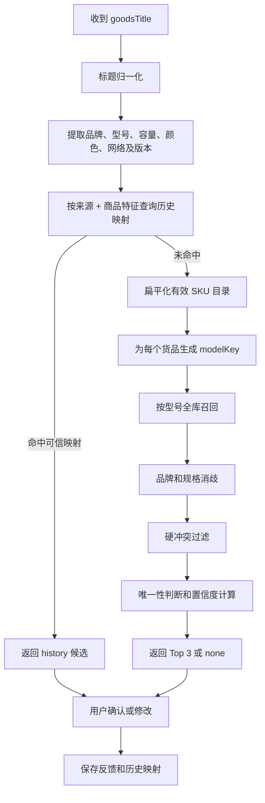

# hc-admin SKU 规则匹配改造实施文档

> 上线状态（2026-08-11）：hc-admin `rule-v2`、V1 一致性双读、歧义反馈保护、扩展请求契约和 V2 backfill 均已完成；两个必需复合索引已在 `cloud1-8gvbotkt966e5e19` 生效，`importOrderFromAssist` 已部署。当前活动 V2 映射共 39 条（25 verified、14 candidate），postcheck 全部命中 existing。4 条曾将网络制式 4G/5G 误识别为容量的旧指纹已标记为 disabled，并由正确指纹替代。hc-admin 云函数目录是唯一源码，扩展仓库不保留本地镜像。

## 1. 文档目的

本文档用于指导在 **hc-admin 所在的另一个项目**中，将赞晨商品 SKU 匹配从当前 `rule-v1` 升级到不依赖商家的 `rule-v2`。

本次改造不引入 LLM，目标是通过确定性规则完成：

- 商家退出 SKU 匹配、评分和历史映射；
- 从赞晨完整商品标题中独立提取型号；
- 从 hc-admin 货品名称中生成标准型号键 `modelKey`；
- 按型号全库召回 SKU；
- 使用品牌、容量、颜色、网络版本和型号版本进行消歧；
- 型号全库唯一且无冲突时高置信度推荐；
- 型号不唯一时展示候选或要求人工选择；
- 保持现有扩展接口、候选展示、自动预填和反馈闭环兼容。

典型修复目标：

```text
赞晨标题：（云途） A72
当前 rule-v1：未找到候选
目标 rule-v2：OPPO / OPPOA72 / 默认，置信度约 0.96
```

## 2. 范围与边界

### 2.1 本次包含

- `matchProductModels` 匹配入口；
- SKU 标题归一化、型号提取、候选召回和评分；
- `source_sku_mapping` 历史映射键调整；
- `submitProductMatchFeedback` 反馈上下文调整；
- `sku_match_log` 匹配日志调整；
- 单元测试和回归测试；
- 算法版本升级为 `rule-v2`。

### 2.2 本次不包含

- LLM 或向量数据库；
- 自动创建 hc-admin 货品或规格；
- 自动拆分套装、多商品标题；
- 根据商家推断品牌或 SKU；
- 修改销售渠道自动选择逻辑；
- 未经用户确认直接静默提交订单。

### 2.3 商家字段的业务边界

商家不参与 SKU 匹配，但其他业务仍可使用商家：

```text
商家名称
├── 销售渠道自动选择：可以使用
├── 订单展示和审计：可以使用
└── SKU 召回、评分和历史映射：禁止使用
```

如果 hc-admin 接口为了兼容旧插件仍收到 `merchant`，可以写入普通审计日志，但匹配代码不得读取它来：

- 筛选候选；
- 增加或降低候选分数；
- 生成历史映射 ID；
- 判断历史映射是否命中；
- 判断匹配反馈上下文是否一致。

## 3. 当前实现基线

当前云函数 `importOrderFromAssist` 的匹配相关文件为：

```text
index.js
productModelsCatalog.js
productModelsCatalog.test.cjs
skuMatcher.js
skuMatcher.test.cjs
skuFeedback.js
skuFeedback.test.cjs
```

当前状态：

- 算法版本为 `rule-v1`；
- `normalizeTitle` 已支持全半角、营销词、部分品牌及 iPhone 别名；
- `flattenCatalog` 已将品牌、货品、规格展开为 SKU；
- `scoreSku` 已支持品牌、型号文本相似度、容量、颜色、网络和版本冲突；
- 候选阈值为 `0.65`，最多返回 3 个；
- 高置信度候选由扩展端自动预填；
- `source_sku_mapping` 已支持三次确认升级为 `verified`；
- 两次目标修正后映射会被禁用；
- 反馈只有在订单成功导入后才计入学习映射；
- 历史映射只负责确定 SKU，数量使用当前订单数量。

当前主要缺陷：

1. `scoreSku` 主要比较完整来源标题与完整货品名称；
2. `（云途） A72` 被归一化成 `云途 a72`；
3. hc-admin 货品名为 `OPPOA72`；
4. `云途a72` 与 `oppoa72` 的完整文本相似度不足；
5. 没有把两边分别提取为相同的型号键 `a72`；
6. 历史映射键和反馈一致性校验都包含商家。

## 4. 目标调用链



## 5. 接口兼容要求

### 5.1 匹配请求

目标请求：

```json
{
  "action": "matchProductModels",
  "source": "zanchenzu",
  "sourceOrderNo": "ME20260801223738444222",
  "goodsTitle": "（云途） A72",
  "goodsQuantity": 1,
  "scene": "afterSale"
}
```

`merchant` 不再是匹配上下文的一部分。

为了兼容尚未升级的旧版扩展，服务端可以接受多余的 `merchant` 字段，但必须忽略。

### 5.2 匹配响应

保持现有响应结构，扩展端无需重写：

```json
{
  "success": true,
  "code": "OK",
  "message": "规则匹配完成",
  "data": {
    "requestId": "match_xxx",
    "normalizedTitle": "云途 a72",
    "catalogVersion": 0,
    "algorithmVersion": "rule-v2",
    "needsConfirmation": true,
    "matchType": "rule",
    "candidates": [
      {
        "items": [
          {
            "skuId": "sku_09cbfb377a3bf17970c57f25",
            "quantity": 1
          }
        ],
        "confidence": 0.96,
        "matchedAttributes": ["型号"],
        "conflicts": [],
        "reason": "型号 A72 在当前有效货品库中唯一"
      }
    ],
    "missingAttributes": ["品牌", "容量", "颜色", "网络版本"]
  }
}
```

`matchType` 本阶段只使用：

- `history`：可信历史映射；
- `rule`：规则匹配；
- `none`：无可靠候选。

不增加 `llm` 类型。

### 5.3 反馈请求

目标反馈请求：

```json
{
  "action": "submitProductMatchFeedback",
  "requestId": "match_xxx",
  "source": "zanchenzu",
  "sourceOrderNo": "ME20260801223738444222",
  "goodsTitle": "（云途） A72",
  "scene": "afterSale",
  "recommendedSkuIds": ["sku_09cbfb377a3bf17970c57f25"],
  "selectedItems": [
    {
      "skuId": "sku_09cbfb377a3bf17970c57f25",
      "quantity": 1
    }
  ],
  "feedbackType": "accepted",
  "operator": {
    "uid": "user_x",
    "username": "operator"
  }
}
```

反馈上下文一致性检查只校验：

- `source`；
- `sourceOrderNo`；
- 归一化标题或商品特征指纹；
- `requestId`；
- 当前有效 SKU 和数量边界。

不得再校验 `normalized_merchant`。

## 6. 数据结构与历史映射调整

### 6.1 当前映射键

当前 `createSourceMappingId` 使用：

```text
source + normalizedMerchant + normalizedTitle
```

这会把相同商品按商家拆成多条映射，不符合“商家不参与 SKU 匹配”的新原则。

### 6.2 目标映射键

第一版建议使用：

```text
source + titleFingerprint
```

其中 `titleFingerprint` 应优先由强商品信号组成：

```text
brand（如果明确） + modelKey + storage + variant + network
```

示例：

```text
（云途） A72
modelKey = a72
fingerprint = model:a72
```

```text
OPPO Reno8 256G 5G
fingerprint = brand:oppo|model:reno8|storage:256gb|network:5g
```

如果暂时不实现特征指纹，也可以先使用：

```text
source + normalizedTitle
```

但这只能消除商家字段依赖，无法让带不同装饰词的同一商品共用历史映射。推荐直接实现 `titleFingerprint`。

### 6.3 新映射 ID

建议新增版本化函数：

```javascript
function createSourceMappingIdV2(source, fingerprint) {
  const key = ['v2', source || '', fingerprint || ''].join('\n');
  return `sku_map_${crypto.createHash('sha256').update(key).digest('hex')}`;
}
```

不要直接静默改变旧 `createSourceMappingId` 的含义而不考虑现有数据。

### 6.4 旧映射迁移策略

推荐采用双读过渡：

1. 优先按 v2 映射 ID 查询；
2. v2 未命中时，按 `source + normalized_title + status=verified` 查询旧映射；
3. 如果所有旧映射指向同一个有效 SKU，则可迁移或临时采用；
4. 如果不同商家的旧映射指向不同 SKU，则视为歧义，不自动命中；
5. 新反馈只写 v2 映射；
6. 稳定运行一段时间后再停止旧映射读取。

如果当前历史映射数据量很少，也可以选择从空的 v2 映射重新积累，但必须在上线说明中明确。

### 6.5 映射文档字段

目标 `source_sku_mapping` 文档建议：

```json
{
  "source": "zanchenzu",
  "source_title": "（云途） A72",
  "normalized_title": "云途 a72",
  "title_fingerprint": "model:a72",
  "target_items": [
    {
      "skuId": "sku_09cbfb377a3bf17970c57f25",
      "quantity": 1
    }
  ],
  "confirmed_order_nos": ["ME001", "ME002", "ME003"],
  "confirmed_count": 3,
  "corrected_count": 0,
  "status": "verified"
}
```

删除或停止使用：

```text
merchant
normalized_merchant
```

为了兼容旧数据，可以暂时保留字段，但新代码不得依赖。

## 7. `skuMatcher.js` 改造

### 7.1 保留现有能力

以下现有函数可继续使用并补充测试：

- `normalizeBase`；
- `normalizeTitle`；
- `diceSimilarity`；
- `extractStorages`；
- `extractKnownTerms`；
- `extractVariant`；
- `isMultiProductTitle`；
- `flattenCatalog` 的基础展开逻辑；
- 容量、颜色、网络、版本冲突判断。

`normalizeMerchant` 和 `MERCHANT_SENTINEL` 不再属于 SKU 匹配模块，可删除；如果其他非 SKU 业务仍需使用，应移动到普通订单工具模块。

### 7.2 增加型号 token 提取

至少支持字母和数字组合型号：

```javascript
function extractModelTokens(value) {
  const normalized = normalizeTitle(value)
    .replace(/\b\d{1,4}(?:gb|tb)\b/g, ' ')
    .replace(/\b[45]g\b/g, ' ');

  const tokens = normalized.match(
    /(?=[a-z0-9]*[a-z])(?=[a-z0-9]*\d)[a-z0-9]+/g
  ) || [];

  return Array.from(new Set(tokens));
}
```

示例：

```javascript
extractModelTokens('（云途） A72');
// ['a72']

extractModelTokens('OPPO Reno8 256G 5G');
// ['reno8']，256gb 和 5g 已排除
```

对于 iPhone、Redmi Note、Pro Max 等多 token 型号，继续使用现有归一化和产品别名，并通过 `modelKey` 补足。

### 7.3 为 hc-admin 货品生成 `modelKey`

`OPPOA72` 不能直接与 `A72` 比较，应先移除品牌前缀：

```javascript
function stripBrandPrefix(productName, brandTerms) {
  const productKey = compact(productName);
  const prefixes = (brandTerms || [])
    .map(compact)
    .filter(Boolean)
    .sort((a, b) => b.length - a.length);

  for (const prefix of prefixes) {
    if (productKey.startsWith(prefix)) {
      return productKey.slice(prefix.length);
    }
  }

  return productKey;
}
```

在 `flattenCatalog` 中增加：

```javascript
const modelKey = stripBrandPrefix(product.name, brandTerms);
const modelTokens = extractModelTokens(modelKey);
```

SKU 扁平结构增加：

```javascript
{
  productName,
  productTerms,
  modelKey,
  modelTokens,
  // 其他现有字段
}
```

示例：

```text
brand = OPPO
productName = OPPOA72
modelKey = a72
modelTokens = [a72]
```

### 7.4 增加精确型号召回

```javascript
function hasExactModelMatch(source, sku) {
  if (source.modelTokens.some(token => sku.modelTokens.includes(token))) {
    return true;
  }

  return source.modelTokens.includes(sku.modelKey);
}
```

候选生成时优先保留：

- 精确型号命中；
- 产品别名命中；
- 完整产品名称命中；
- 现有文本相似度达到较高阈值。

不能再仅依赖完整标题的 Dice 相似度。

### 7.5 增加型号唯一性统计

对精确型号命中的候选，统计不同货品和不同 SKU 数量：

```javascript
function getModelUniqueness(candidates) {
  return {
    productCount: new Set(
      candidates.map(item => item.productId || `${item.brand}|${item.productName}`)
    ).size,
    skuCount: new Set(candidates.map(item => item.skuId)).size,
  };
}
```

决策：

- 一个型号只对应一个货品、一个规格：可高置信度推荐；
- 一个型号对应一个货品、多个规格：使用容量等规格属性消歧；
- 一个型号对应多个品牌：标题有品牌时按品牌消歧；
- 一个型号对应多个品牌且标题无品牌：不得自动预填。

### 7.6 评分建议

在保留现有冲突规则的基础上，增加可解释的精确型号和唯一性证据。

初始建议：

```text
精确型号命中：主要证据
型号全库唯一：显著加分
只有一个有效规格：加分
明确品牌一致：加分
容量或型号版本冲突：强制降到自动预填阈值以下
颜色或网络冲突：降低置信度并返回 conflicts
只有模糊文本相似：不得高置信度自动预填
```

为了与当前扩展的 `0.90` 自动预填阈值配合，推荐结果应满足：

```text
A72 精确命中 + 型号唯一 + 单规格 = 约 0.96
OPPO A72 + 型号唯一 + 单规格 = 约 0.99
Y33S 多品牌且无品牌信息 = 低于 0.90
```

不要把“标题未提供容量、颜色”等视为冲突。缺失属性只写入 `missingAttributes`。

### 7.7 多商品继续人工处理

保留当前策略：

```text
套装、套餐、组合、赠送、+、两台等
→ matchType: none
→ 人工选择
```

本阶段不自动拆分多个 SKU。

## 8. `index.js` 改造

### 8.1 算法版本

```javascript
const SKU_MATCH_ALGORITHM_VERSION = 'rule-v2';
```

### 8.2 import 调整

从 SKU 匹配依赖中移除：

```javascript
normalizeMerchant
MERCHANT_SENTINEL
```

增加：

```javascript
buildTitleFingerprint
createSourceMappingIdV2
```

### 8.3 `matchProductModels`

删除匹配上下文中的：

```javascript
const merchant = ...;
const normalizedMerchant = normalizeMerchant(merchant);
```

增加：

```javascript
const normalizedTitle = normalizeTitle(goodsTitle);
const titleFingerprint = buildTitleFingerprint(goodsTitle);
```

`common` 响应中不再需要 `normalizedMerchant`。

匹配日志增加：

```text
title_fingerprint
algorithm_version = rule-v2
```

审计上确有需要时可以继续记录请求中的原始 `merchant`，但必须明确它不进入匹配上下文。

历史映射查询从：

```javascript
fetchHistoryMapping(source, normalizedMerchant, normalizedTitle)
```

调整为：

```javascript
fetchHistoryMappingV2(source, titleFingerprint)
```

### 8.4 `submitProductMatchFeedback`

删除：

```javascript
const merchant = ...;
const normalizedMerchant = normalizeMerchant(merchant);
```

反馈上下文校验删除：

```javascript
initialLog.normalized_merchant !== normalizedMerchant
```

改为校验：

```javascript
initialLog.title_fingerprint === buildTitleFingerprint(goodsTitle)
```

映射 ID 改用：

```javascript
createSourceMappingIdV2(source, titleFingerprint)
```

传给 `buildNextMapping` 的上下文删除商家字段，增加：

```javascript
titleFingerprint
```

保留当前以下安全约束：

- `requestId` 必填；
- 反馈只能处理一次；
- 学习反馈必须包含来源订单号和 SKU；
- 选择数量不能超过来源数量；
- 反馈 SKU 必须存在且有效；
- 只有确认成功导入的订单才能计入学习映射；
- 数据库事务保证映射和日志的一致性。

## 9. `skuFeedback.js` 改造

`buildNextMapping` 当前写入：

```javascript
merchant
normalized_merchant
```

目标改为：

```javascript
return {
  source: context.source,
  source_title: context.goodsTitle,
  normalized_title: context.normalizedTitle,
  title_fingerprint: context.titleFingerprint,
  target_items: selectedItems,
  // 其余确认、修正、状态和审计字段保持不变
};
```

继续保留：

- 三个不同成功导入订单确认后升级为 `verified`；
- 重复上报同一个订单号不重复计数；
- 目标 SKU 改变时重置确认次数；
- 两次修正后设为 `disabled`；
- 单 SKU 映射保存单位数量 1；
- 当前匹配数量始终来自当前订单。

### 9.1 不唯一型号的学习限制

商家退出后，必须防止将模糊标题错误升级为全局映射。

例如：

```text
标题：Y33S
候选：OPPO/Y33S、vivo/Y33S
```

即使用户本次人工选择 vivo，也不能仅凭 `model:y33s` 将其升级为全局可信映射。

以下任一条件满足后才允许升级：

- 标题明确包含品牌；
- 型号在当前货品库中全局唯一；
- 指纹包含能够唯一消歧的规格属性；
- 管理员人工审核通过。

建议在映射中记录：

```json
{
  "promotable": false,
  "ambiguity_reason": "型号 Y33S 存在多个品牌"
}
```

`promotable=false` 时可以保留反馈日志，但不能升级为 `verified` 自动命中。

## 10. 扩展端配套修改

另一个项目完成 hc-admin 修改后，本扩展需做小范围配套：

### `content-script.js`

匹配请求删除：

```javascript
merchant: order.merchant || ''
```

匹配反馈可以删除 `merchant`。如果为了审计暂时保留，hc-admin 也必须忽略其匹配含义。

### `background.js`

`matchHcAdminProductModels` payload 删除：

```javascript
merchant: String(request?.merchant || '').trim()
```

`submitHcAdminProductMatchFeedback` payload 同步删除商家，或者仅作为非匹配审计字段保留。

### 不应修改

以下逻辑与 SKU 匹配无关，应保留：

```javascript
mapMerchantToChannel(order.merchant)
```

它只负责销售渠道自动选择。

现有候选解析、Top 3 展示、`confidence >= 0.9` 自动预填、人工修正和数量校验均可继续使用。

## 11. 必须新增或调整的测试

### 11.1 `skuMatcher.test.cjs`

#### A72 噪声标题

```javascript
test('extracts a unique model from a noisy merchant-prefixed title', () => {
  const result = buildRuleMatch({
    goodsTitle: '（云途） A72',
    goodsQuantity: 1,
    brands: oppoCatalog(),
  });

  assert.equal(result.matchType, 'rule');
  assert.equal(result.candidates[0].items[0].skuId, 'sku_oppo_a72');
  assert.ok(result.candidates[0].confidence >= 0.9);
  assert.deepEqual(result.candidates[0].conflicts, []);
});
```

#### 同一标题不受 merchant 参数影响

如果底层匹配函数不再接收商家，则不需要专门传入商家；接口级测试应验证额外 `merchant` 不改变响应候选。

#### 多品牌同型号

```javascript
test('does not auto-fill an ambiguous model without a brand', () => {
  const result = buildRuleMatch({
    goodsTitle: 'Y33S',
    goodsQuantity: 1,
    brands: ambiguousY33sCatalog(),
  });

  assert.ok(result.candidates.length >= 2);
  assert.ok(result.candidates[0].confidence < 0.9);
});
```

#### 品牌消歧

```javascript
test('uses an explicit brand to disambiguate duplicate model names', () => {
  const result = buildRuleMatch({
    goodsTitle: 'vivo Y33S',
    goodsQuantity: 1,
    brands: ambiguousY33sCatalog(),
  });

  assert.equal(result.candidates[0].items[0].skuId, 'sku_vivo_y33s');
  assert.ok(result.candidates[0].confidence >= 0.9);
});
```

#### 容量冲突

保留并加强现有测试：

```text
来源 256GB 不得自动选择 128GB
```

#### 版本冲突

新增：

```text
Pro Max 不得自动选择 Pro
有锁不得自动选择无锁
解 BL 不得自动选择普通规格
5G 不得自动选择明确的 4G 规格
```

#### 缺失不是冲突

新增：

```text
来源没有容量、颜色、网络时，不应生成对应 conflicts
```

### 11.2 `skuFeedback.test.cjs`

删除测试上下文中的：

```text
merchant
normalizedMerchant
```

增加：

```text
titleFingerprint
```

将“映射 ID 按商家隔离”的旧测试替换为：

```javascript
test('source mapping ID is independent of merchant', () => {
  const first = createSourceMappingIdV2('zanchenzu', 'model:a72');
  const second = createSourceMappingIdV2('zanchenzu', 'model:a72');
  assert.equal(first, second);
});
```

增加多品牌歧义映射不能升级为 `verified` 的测试。

### 11.3 接口集成测试

至少覆盖：

1. `（云途） A72` 返回 OPPOA72；
2. `A72` 与 `（云途） A72` 返回相同 Top 1 SKU；
3. 是否携带 `merchant` 不改变候选；
4. `Y33S` 无品牌时不自动预填；
5. `vivo Y33S` 能正确消歧；
6. 候选 SKU 必须存在于当前有效目录；
7. 停用 SKU 不进入候选；
8. 反馈不再因为商家字段缺失而返回 `MATCH_CONTEXT_MISMATCH`；
9. 三个不同成功订单确认后历史映射生效；
10. 历史映射 SKU 停用后自动失效；
11. 套装标题继续进入人工选择；
12. 售后场景数量保持为 1，普通导入使用来源数量。

## 12. 本地验证步骤

在 hc-admin 项目中执行：

```bash
node --test productModelsCatalog.test.cjs
node --test skuMatcher.test.cjs
node --test skuFeedback.test.cjs
node --check index.js
node --check skuMatcher.js
node --check skuFeedback.js
```

如果项目有统一测试命令，应优先使用项目自己的命令。

本地启动后，使用以下对照请求验证：

| 标题 | 预期 |
| --- | --- |
| `（云途） A72` | OPPOA72，约 0.96 |
| `A72` | 与上一条相同 SKU |
| `OPPO A72` | OPPOA72，品牌和型号匹配 |
| `Y33S` | 多候选，不自动预填 |
| `vivo Y33S` | vivo Y33S |
| `OPPO Reno8 256G` | 256G 规格，不选 128G |
| 完全无关标题 | `matchType: none` |
| 套装或多商品标题 | `matchType: none`，人工选择 |

## 13. 数据库与上线注意事项

### 13.1 集合

涉及集合：

- `product_models`；
- `source_sku_mapping`；
- `sku_match_log`；
- `order_import_logs`，仅用于验证成功导入证据。

### 13.2 索引

如果按字段查询旧映射或 v2 指纹，确认存在合适索引：

```text
source + title_fingerprint + status
source + normalized_title + status（迁移期旧数据查询）
```

### 13.3 日志

每次匹配至少记录：

- `request_id`；
- `source_order_no`；
- 原始标题；
- 归一化标题；
- 商品特征指纹；
- 目录版本；
- `algorithm_version=rule-v2`；
- 候选、置信度、匹配属性和冲突；
- 耗时；
- 最终反馈类型和所选 SKU。

不要记录手机号、收件地址等与 SKU 匹配无关的个人信息。

### 13.4 灰度建议

上线时可保留 `rule-v1` 作为短期回滚版本，但同一次请求只执行一个正式算法。

建议顺序：

1. 本地单元测试；
2. 使用真实标题离线回放；
3. 测试环境联调扩展；
4. 小范围灰度；
5. 观察无候选率、Top 1 采用率和修正率；
6. 确认历史映射迁移稳定后全量。

## 14. 验收标准

### 功能验收

- 商家字段不参与候选、评分和历史映射；
- `（云途） A72` 能匹配 OPPOA72；
- 型号全库唯一时可以高置信度推荐；
- 多品牌同型号且标题无品牌时不自动决定；
- 品牌存在时可以正确消歧；
- 容量和型号版本硬冲突不会自动预填；
- 缺失容量、颜色或网络不会被当作冲突；
- 历史映射不再按商家拆分；
- 反馈闭环和导入证据校验继续有效；
- 匹配失败不阻断人工填单。

### 质量验收

- 无效或停用 SKU 返回率为 0；
- 唯一型号测试集准确率为 100%；
- 高置信度候选准确率不低于 98%；
- Top 3 召回率不低于 95%；
- 所有现有导入、售后、数量和幂等测试通过；
- 不增加 LLM、模型密钥或外部推理依赖。

## 15. 修改清单

在 hc-admin 项目提交前逐项确认：

- [ ] `SKU_MATCH_ALGORITHM_VERSION` 改为 `rule-v2`；
- [ ] 匹配接口不再使用 `merchant`；
- [ ] 反馈一致性校验不再使用 `normalized_merchant`；
- [ ] 历史映射 ID 不再包含商家；
- [ ] 设计并实现 `titleFingerprint`；
- [ ] 设计旧映射双读或重新积累策略；
- [ ] `flattenCatalog` 增加 `modelKey/modelTokens`；
- [ ] 来源标题增加 `modelTokens`；
- [ ] 实现精确型号全库召回；
- [ ] 实现型号唯一性判断；
- [ ] 同型号多品牌时禁止高置信度自动预填；
- [ ] 保留容量、颜色、网络、版本冲突；
- [ ] 不把缺失属性当成冲突；
- [ ] 模糊文本相似候选不得错误升为高置信度；
- [ ] `source_sku_mapping` 写入商品特征指纹；
- [ ] 歧义标题反馈不得升级为全局可信映射；
- [ ] A72、Y33S、容量冲突等测试通过；
- [ ] 扩展端候选响应兼容测试通过；
- [ ] 本地验证通过后再进入测试环境，不直接修改线上。

## 16. 最终实现原则

```text
rule-v1：判断完整来源标题像不像完整 hc-admin 货品名称

rule-v2：从来源标题和 hc-admin 货品中分别提取型号，再用品牌和规格消歧
```

本次改造的关键不是删除“云途”这一个固定词，而是让任何不相关的标题前缀都不再干扰核心型号匹配。
