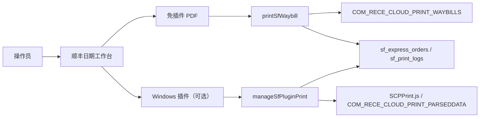

# 顺丰丰密面单跨平台打印设计文档

> 状态：已实现
>
> 版本：V1.0
>
> 日期：2026-07-24
> 平台：Windows、macOS

## 1. 目标

对 V2 独立顺丰订单记录提供丰密面单打印：

- Windows、macOS 默认均可使用顺丰官方 PDF 云打印，不依赖本地插件。
- Windows 可选使用 `SCPPrint.js 2.7` 和顺丰云打印插件，支持打印机枚举、选择、预览和直接打印。
- 两条通道共用权限、环境、模板、运单校验和审计口径。

本期只支持普通单票逐单打印，不实现批量打印、子母单和签回单。

## 2. 数据来源

打印接口只接受 `sfExpressOrderId`，从 `sf_express_orders` 读取：

- 当前状态必须为 `applied`
- `env` 必须等于当前系统顺丰环境
- 必须存在 `waybillNo`

不再从 `orders` 读取 `sfWaybillNo`、`sfEnv`、`expressApplyStatus` 或打印统计。

打印日志 `sf_print_logs` 保存 `sfExpressOrderId` 和 `sourceOrderId`。打印成功后只更新：

```text
sf_express_orders.printCount
sf_express_orders.lastPrintTime
sf_express_orders.lastPrintRequestId
```

## 3. 总体架构



## 4. PDF 免插件打印

请求：

```json
{ "sfExpressOrderId": "sf_express_orders._id" }
```

`printSfWaybill`：

1. 校验登录用户具有 `sf:print`。
2. 校验独立顺丰记录的状态、环境和运单号。
3. 使用模板编码调用 `COM_RECE_CLOUD_PRINT_WAYBILLS`，`fileType=pdf`、`sync=true`；
   `documents[].remark` 和 `documents[].customData.hc_text` 均读取
   `sf_express_orders.orderSnapshot.customerRemark`，最大 100 字符。
4. 后端携带顺丰下载 Token 下载 PDF，限制文件大小并校验 `%PDF-` 文件头。
5. 校验下载地址只能解析到公网地址，限制重定向次数。
6. 事务写入打印日志并累计独立顺丰记录打印次数。
7. 返回 Base64；浏览器已在用户点击时预开窗口，收到结果后展示 PDF 并尝试调用系统打印。

模板编码按顺丰云打印协议拆分为基础模板和已发布的自定义模板：

```text
templateCode       = fm_76130_standard_HCSMKBNA9WWC
customTemplateCode = fm_76130_standard_custom_10057208710_3
```

云函数分别通过 `SF_PRINT_TEMPLATE_CODE` 和 `SF_CUSTOM_TEMPLATE_CODE` 维护；
沙箱、生产环境可使用对应的分环境变量覆盖。

## 5. Windows 插件打印

插件功能通过 `system_config/sf_express.pluginPrintEnabledByEnv[env]` 分环境控制。

### 5.1 `bootstrap`

返回 SDK 环境、客户编码、插件开关和 SDK 版本，不返回 Token。

### 5.2 `prepare`

请求：

```json
{
  "action": "prepare",
  "sfExpressOrderId": "sf_express_orders._id",
  "operation": "print"
}
```

后端完成权限、环境、状态和运单校验，创建 `prepared` 打印会话，再返回 SDK 必需的短效 Token、模板和 documents。
`documents[].remark` 和 `documents[].customData.hc_text` 同样读取顺丰下单时保存的订单备注快照。
其中 `hc_text` 是自定义模板绑定的动态字段，不写死固定文案。Token 只保存在函数局部变量中，
不写入 React 状态、localStorage 或日志。

### 5.3 `record`

前端按 `requestID` 回传 SDK 结果。后端读取打印会话，不信任前端重复提交的订单和环境信息。

- `print + code=1`：`succeeded`，累计一次打印
- `preview + code=1/15`：`previewed`，不累计
- 其他：`failed`，不累计
- 已完成会话重复回调：直接返回原结果，不重复累计
- `A1011` Token 失效：仅允许同一操作人消费一次刷新重试资格

## 6. 打印机与平台交互

- SDK 固化于 `public/vendor/sf/SCPPrint.js`，避免生产页面运行时依赖第三方 CDN。
- Windows 插件可用后调用 `getPrinters`，选择后调用 `setPrinter`。
- 仅将打印机名称按环境保存到 `localStorage`。
- 保存的打印机不存在时回退列表第一项，并提示重新选择。
- macOS 和其他平台只显示 PDF 打印。
- 插件不可用、版本过低或未启用时，PDF 通道仍可使用。

## 7. 权限与安全

- 前端按钮受 `can('sf:print')` 控制。
- `printSfWaybill` 和 `manageSfPluginPrint` 后端再次强制校验 `sf:print`。
- 下单 Token 不下发浏览器。
- 插件 Token 是顺丰 SDK 协议的受控例外，只在开启插件通道时短时返回。
- 顺丰 PDF 下载 Token 不返回浏览器。
- 日志消息对 Token/Authorization 脱敏并限制长度。

## 8. 验收

- Windows：PDF 打印可用；启用插件后可枚举打印机、预览、直接打印。
- macOS：PDF 打印可用，不显示 Windows 打印机选择。
- 已取消、未成功、环境不一致和没有运单号的记录无法打印。
- PDF 和插件成功打印均更新独立顺丰记录与打印日志，不写订单顺丰专属字段。
- 重复插件回调不重复计数。
