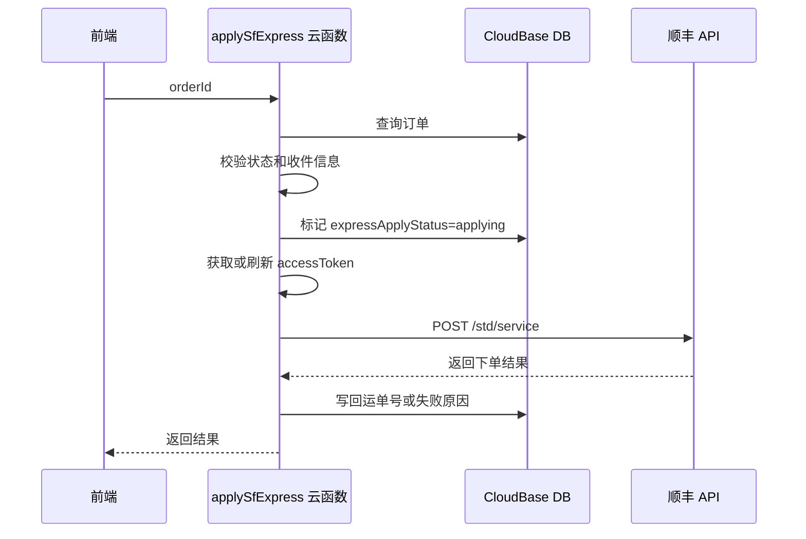

# 顺丰快递对接方案

## 1. 目标

在订单列表中，为订单状态为 `--` 的订单提供“申请快递”能力。当前阶段先完成方案设计，不急于实现。

最终目标：

- 后台通过顺丰 OAuth2 获取并缓存 `accessToken`
- 后台调用顺丰下订单接口 `EXP_RECE_CREATE_ORDER`
- 成功后将顺丰运单号写回订单
- 前端订单列表根据快递申请状态展示“申请快递 / 申请中 / 查看快递 / 申请失败”等操作

## 2. 设计原则

- 顺丰客户编码、校验码、`accessToken` 只能放在云函数后端，不允许出现在前端代码中。
- 沙箱和生产环境通过环境变量切换，不改业务代码。
- 申请快递必须做幂等处理，避免重复点击导致重复下单。
- 外层顺丰接口调用成功不等于业务下单成功，需要继续解析 `apiResultData` 内层结果。
- 日志需要脱敏，避免打印完整手机号、地址、校验码和 token。

## 3. 环境与配置

### 3.1 顺丰接口地址

OAuth2 获取 token：

| 环境 | URL |
| --- | --- |
| 沙箱 | `https://sfapi-sbox.sf-express.com/oauth2/accessToken` |
| 生产 | `https://bspgw.sf-express.com/oauth2/accessToken` |

业务接口：

| 环境 | URL |
| --- | --- |
| 沙箱 | `https://sfapi-sbox.sf-express.com/std/service` |
| 生产 | `https://bspgw.sf-express.com/std/service` |

### 3.2 云函数环境变量

建议配置：

```txt
SF_ENV=sandbox
SF_CLIENT_CODE=<默认顺丰客户编码>
SF_SANDBOX_CLIENT_CODE=<沙箱客户编码，可选>
SF_PROD_CLIENT_CODE=<生产客户编码，可选>
SF_SANDBOX_CHECK_WORD=<沙箱校验码>
SF_PROD_CHECK_WORD=<生产校验码>
SF_SANDBOX_ACCESS_TOKEN_URL=<沙箱 token 地址，可选>
SF_PROD_ACCESS_TOKEN_URL=<生产 token 地址，可选>
SF_SANDBOX_SERVICE_URL=<沙箱业务接口地址，可选>
SF_PROD_SERVICE_URL=<生产业务接口地址，可选>
SF_PAY_METHOD=1
SF_MONTHLY_CARD=<顺丰月结卡号>
SF_EXPRESS_TYPE_ID=1
SF_PARCEL_QTY=1

SF_SENDER_MAP={"XX":{"contact":"寄件人姓名","tel":"寄件电话","province":"省","city":"市","county":"区县","address":"详细地址"}}
SF_SENDER_CONTACT=<默认寄件人>
SF_SENDER_TEL=<默认寄件电话>
SF_SENDER_COMPANY=<默认寄件公司>
SF_SENDER_PROVINCE=<默认寄件省>
SF_SENDER_CITY=<默认寄件市>
SF_SENDER_COUNTY=<默认寄件区县>
SF_SENDER_ADDRESS=<默认寄件详细地址>
```

`SF_SENDER_MAP` 用订单字段 `salesperson` 匹配寄件人信息。配置后，`applySfExpress` 会按实际订单人员切换寄件人姓名、电话、地址；如果某个订单人员没有配置，会拒绝下单，避免使用错误寄件人。

`SF_ENV` 支持 `sandbox`、`sbox`、`production`、`prod`。两个云函数 `getSfAccessToken` 和 `applySfExpress` 必须配置为同一个环境；`applySfExpress` 调用 token 函数时会传入期望环境，如果两边不一致会直接失败，避免生产下单误用沙盒 token。

如果沙盒和生产使用同一个客户编码，只配置 `SF_CLIENT_CODE` 即可；如果不同，分别配置 `SF_SANDBOX_CLIENT_CODE` 和 `SF_PROD_CLIENT_CODE`，它们会优先于 `SF_CLIENT_CODE`。

使用月结时配置 `SF_MONTHLY_CARD`，下单云函数会写入顺丰 `msgData.monthlyCard`。

注意：不要把校验码写入仓库文件。生产上线前建议确认生产校验码没有泄漏；如已在非安全渠道出现，建议更换。

## 4. OAuth2 获取 accessToken

### 4.1 请求方式

```txt
POST /oauth2/accessToken
Content-Type: application/x-www-form-urlencoded;charset=UTF-8
```

请求参数：

| 参数 | 必填 | 说明 |
| --- | --- | --- |
| `partnerID` | 是 | 顺丰客户编码 |
| `secret` | 是 | 校验码 / checkWord |
| `grantType` | 是 | 固定传 `password` |

### 4.2 成功返回

关键字段：

```json
{
  "apiResultCode": "A1000",
  "apiErrorMsg": "success",
  "apiResponseID": "...",
  "accessToken": "...",
  "expiresIn": 7199
}
```

`expiresIn` 单位为秒。建议缓存 token，并提前 5 分钟刷新。

### 4.3 token 缓存集合

建议新增集合 `sf_tokens`：

```ts
interface SfTokenRecord {
  _id?: string;
  env: 'sandbox' | 'production';
  accessToken: string;
  expiresAt: number;
  expiresIn: number;
  updateTime: Date;
}
```

获取 token 逻辑：

1. 查询当前环境的 token
2. 如果 `expiresAt > Date.now() + 5 * 60 * 1000`，直接复用
3. 否则调用 OAuth2 接口重新获取
4. 保存新 token
5. 返回 `accessToken`

## 5. 下订单接口

接口文档：`下订单接口-EXP_RECE_CREATE_ORDER`

服务代码：

```txt
EXP_RECE_CREATE_ORDER
```

请求方式：

```txt
POST /std/service
Content-Type: application/x-www-form-urlencoded;charset=UTF-8
```

公共参数：

| 参数 | 必填 | 说明 |
| --- | --- | --- |
| `partnerID` | 是 | 顺丰客户编码 |
| `requestID` | 是 | 请求唯一号，建议使用稳定幂等 ID |
| `serviceCode` | 是 | 固定 `EXP_RECE_CREATE_ORDER` |
| `timestamp` | 是 | 当前时间戳 |
| `accessToken` | 条件 | OAuth2 方式必传 |
| `msgData` | 是 | 业务 JSON 字符串 |

本项目走 OAuth2，因此不使用 `msgDigest`。

## 6. 最小可用 msgData

推荐先接入国内普通件的最小字段：

```json
{
  "language": "zh-CN",
  "orderId": "ORDER_123456",
  "cargoDetails": [
    {
      "name": "手机",
      "count": 1,
      "unit": "件"
    }
  ],
  "contactInfoList": [
    {
      "contactType": 1,
      "company": "寄件公司",
      "contact": "寄件人",
      "tel": "寄件电话",
      "country": "CN",
      "province": "寄件省",
      "city": "寄件市",
      "county": "寄件区县",
      "address": "寄件详细地址"
    },
    {
      "contactType": 2,
      "contact": "收件人",
      "mobile": "收件人手机",
      "country": "CN",
      "address": "收件详细地址"
    }
  ],
  "payMethod": 1,
  "monthlyCard": "7555396782",
  "expressTypeId": 1,
  "parcelQty": 1
}
```

字段说明：

| 字段 | 建议值 | 说明 |
| --- | --- | --- |
| `language` | `zh-CN` | 中文 |
| `orderId` | 本系统稳定订单号 | 不能重复，否则可能返回重复订单错误 |
| `contactInfoList[0].contactType` | `1` | 寄件方 |
| `contactInfoList[1].contactType` | `2` | 收件方 |
| `country` | `CN` | 国内件 |
| `payMethod` | `1` | 寄付，后续可配置 |
| `expressTypeId` | `1` | 快件产品类别，后续可配置 |
| `parcelQty` | `1` | 包裹数 |

## 7. 系统订单字段映射

当前订单字段到顺丰字段建议如下：

| 系统字段 | 顺丰字段 | 说明 |
| --- | --- | --- |
| `_id` 或 `serialNumber` | `orderId` | 建议使用稳定且唯一的业务订单号 |
| `consignee` | 收件方 `contact` | 收件人 |
| `consigneePhone` | 收件方 `mobile` | 收件手机号 |
| `consigneeAddress` | 收件方 `address` | 收件详细地址 |
| `salesperson` | 寄件方配置 key | 用 `SF_SENDER_MAP[salesperson]` 切换寄件人 |
| `productName` | `cargoDetails[0].name` | 货物名称 |
| `quantity` | `cargoDetails[0].count` | 数量 |
| `specification` | 可拼入货物名称或备注 | 非必填 |

寄件人信息由云函数环境变量维护，优先按订单 `salesperson` 从 `SF_SENDER_MAP` 获取；未配置映射时使用默认寄件人环境变量。

## 8. 订单表字段扩展

建议在 `orders` 集合增加快递相关字段：

```ts
interface SfExpressFields {
  expressProvider?: 'sf';
  expressApplyStatus?: 'notApplied' | 'applying' | 'applied' | 'failed' | 'cancelled';
  expressApplyTime?: string;
  expressErrorMsg?: string;

  sfRequestId?: string;
  sfOrderId?: string;
  sfWaybillNo?: string;
  sfRawResponse?: unknown;

  trackingNumber?: string;
}
```

状态含义：

| 状态 | 说明 |
| --- | --- |
| `notApplied` | 未申请 |
| `applying` | 正在申请，防重复点击 |
| `applied` | 申请成功 |
| `failed` | 申请失败，可重试 |
| `cancelled` | 已取消，预留 |

## 9. 返回解析

顺丰接口外层成功：

```json
{
  "apiResultCode": "A1000",
  "apiResultData": "{...}"
}
```

需要继续解析 `apiResultData`。

业务成功通常为：

```json
{
  "success": true,
  "errorCode": "S0000",
  "msgData": {
    "orderId": "...",
    "waybillNoInfoList": [
      {
        "waybillType": 1,
        "waybillNo": "SF..."
      }
    ]
  }
}
```

运单号获取：

```ts
const waybillNo = msgData.waybillNoInfoList?.[0]?.waybillNo;
```

成功后写回：

```ts
{
  expressProvider: 'sf',
  expressApplyStatus: 'applied',
  sfRequestId,
  sfOrderId: msgData.orderId,
  sfWaybillNo: waybillNo,
  trackingNumber: waybillNo,
  sfRawResponse: response,
  expressApplyTime: new Date().toISOString()
}
```

## 10. 云函数设计

### 10.1 建议云函数

```txt
getSfAccessToken
applySfExpress
querySfExpressStatus
```

第一阶段可以先实现：

```txt
applySfExpress
```

其中内部包含 token 获取与缓存。

### 10.2 applySfExpress 入参

```ts
interface ApplySfExpressRequest {
  orderId: string;
}
```

### 10.3 applySfExpress 流程



### 10.4 幂等设计

建议：

```ts
sfRequestId = `sf_apply_${order._id}`;
sfOrderId = `HC_${order.serialNumber || order._id}`;
```

幂等规则：

- 如果已有 `sfWaybillNo`，直接返回已申请结果
- 如果 `expressApplyStatus === 'applying'` 且未超时，提示正在申请
- 如果上次 `failed`，允许重试
- 重试仍使用同一个 `sfOrderId`，避免顺丰重复创建不可控订单

## 11. 前端设计

订单列表：

- 状态为 `--` 的订单显示“申请快递”
- 已申请的订单显示“查看快递”
- 申请失败显示“申请失败”或允许“重新申请”

点击“申请快递”：

1. 打开确认弹窗
2. 展示收件人、电话、地址、货品信息
3. 若信息缺失，禁用提交并提示编辑订单
4. 点击确认后调用 `applySfExpress`
5. 成功后刷新订单列表

前端不直接调用顺丰 API。

## 12. 必填校验

申请前云函数至少校验：

- 订单存在
- 订单状态为 `unknown` 或历史值 `--`
- `consignee` 不为空
- `consigneePhone` 不为空
- `consigneeAddress` 不为空
- `productName` 不为空
- 默认寄件人配置完整

如果缺失，返回明确错误，例如：

```json
{
  "success": false,
  "errMsg": "收件人电话不能为空"
}
```

## 13. 错误处理

平台错误：

- `A1000`：平台调用成功，需要继续看业务结果
- `A1001`：必传参数不可为空
- `A1011`：OAuth2 认证失败
- `A1006`：数字签名无效；OAuth2 模式下一般检查 token 与公共参数

业务错误示例：

- `8016`：重复下单
- `1014`：到件地址不能为空
- `1015`：到件联系人不能为空
- `1016`：到件电话不能为空
- `1023`：托寄物品名不能为空

处理建议：

- 可修复的订单信息错误：返回给前端提示用户编辑订单
- OAuth2 失败：刷新 token 后重试一次
- 重复下单：尝试根据已有返回或顺丰查询接口恢复运单号
- 其他错误：写入 `expressErrorMsg`，状态置为 `failed`

## 14. 安全与日志

日志禁止打印：

- 校验码
- `accessToken`
- 完整手机号
- 完整地址

建议脱敏：

```ts
function maskPhone(phone: string) {
  return phone.replace(/^(\d{3})\d+(\d{4})$/, '$1****$2');
}
```

## 15. 分阶段实施计划

### 阶段 1：沙箱 token 联调

- 新增云函数内部工具 `getSfAccessToken`
- 使用沙箱 URL
- 成功获取并缓存 token

### 阶段 2：沙箱下单联调

- 新增 `applySfExpress`
- 使用固定测试订单或真实订单数据
- 调用 `EXP_RECE_CREATE_ORDER`
- 写回 `sfWaybillNo` 和 `trackingNumber`

### 阶段 3：前端接入

- 订单列表“申请快递”按钮调用云函数
- 增加确认弹窗
- 增加 loading、成功、失败提示

### 阶段 4：状态查询与异常恢复

- 增加查询接口
- 支持重复下单恢复运单号
- 支持失败重试

### 阶段 5：生产切换

- 配置生产环境变量
- `SF_ENV=production`
- 小批量订单验证

## 16. 后续待确认

- 默认寄件人信息由系统设置维护，还是只放云函数环境变量
- `payMethod` 是否固定寄付
- `expressTypeId` 是否固定为 `1`
- 是否需要预约上门时间 `sendStartTm`
- 是否需要打印面单或仅获取运单号
- 下单成功后，订单状态是否自动从 `--` 改为 `shipped`
